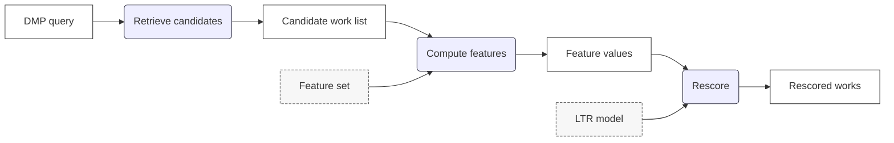
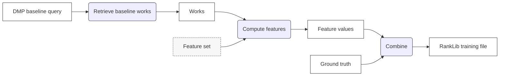

# Architecture

## 1. Dataset Transforms
Raw datasets are first cleaned and normalised. Crossref Metadata, DataCite and
OpenAlex Works are separated into individual tables for works, authors, 
affiliations, funders and relations.

Transformations are performed using [Polars](https://pola.rs), a fast,
multi-threaded DataFrame library. Polars provides a consistent transformation
syntax and supports high-performance custom transformations written in Rust.

Identifiers are extracted from OpenAlex Funders and ROR to support SQL Mesh 
transformations that unify various identifier types (e.g. GRID, ISNI) into ROR 
and Crossref Funder Ids.

The processed data is stored into Parquet format, which is optimised for 
columnar databases such as DuckDB.

Common transformation steps include:
* Removing HTML markup from titles and abstracts; convert empty strings to null.
* Standardising date formats.
* Normalising identifiers, for example, by stripping URL prefixes.

DataCite specific transformations:
* Fixing inconsistencies in `affiliation` and `nameIdentifiers` schemas, which
can be lists or a single object.
* Extracting ORCID IDs from `nameIdentifiers`.

OpenAlex Works:
* Un-invert inverted abstract, e.g. `{"Hello":[0],"World":[1]}` to `Hello World`.

## 2. Works Index
A unified "Works Index" is created by joining transformed source datasets
together. Each item contains a DOI, title, abstract, publication date, updated
date, affiliation names, affiliation ROR IDs, author names, author ORCID IDs,
funder names, award IDs and funder IDs.

The works index is created with [SQL Mesh](https://sqlmesh.readthedocs.io/en/latest/)
and [DuckDB](https://duckdb.org). SQLMesh is a tool for writing SQL data 
transformations and DuckDB is an embedded SQL database.

The works index consists of all works from DataCite, and works from OpenAlex
with DOIs that are not found in DataCite.

The transformations specific to DataCite include:
* Supplement records with OpenAlex metadata.
* Unify various identifier types (e.g. GRID, ISNI) into ROR and Crossref Funder 
Ids.
* Standardise work types.

The transformations specific OpenAlex include:
* Handling duplicate DOIs: different OpenAlex Works have the same DOI.
* Supplementing records with information from Crossref Metadata, including
titles and abstracts and funding information.

The final model `works_index.exports` exports the works index to Parquet.

## 3. OpenSearch
[OpenSearch](https://opensearch.org) is used to match related works to
Data Management Plans.

## 4. Learning to Rank
OpenSearch Learning to Rank (LTR) is used to re-rank search results using a machine
learning model trained on a ground truth dataset of DMP-to-published-work
matches.

See here for an in-depth guide to LTR in the AWS OpenSearch Service:
https://docs.aws.amazon.com/opensearch-service/latest/developerguide/learning-to-rank.html

### Search Process
This diagram shows how search results are reranked using a trained LTR model.

A DMP query is first used to retrieve an initial list of candidate works using 
a baseline search. For each candidate, a predefined feature set is applied to 
compute feature values that describe the relationship between the DMP and the 
candidate works. These feature values, together with the trained LTR model, 
are then used to rescore the candidates. The output is the same set of candidate 
works, reordered according to their predicted relevance.

### Training Process
This diagram shows how training data is prepared for training the LTR model.

A baseline query is run for each DMP to retrieve a set of candidate works.
The same feature set used at search time is applied to compute feature values
for these candidates. The computed feature values are then combined with ground
truth relevance judgments to produce a RankLib-formatted training file. 
This training file is used to train the LTR model that is later applied during 
search reranking.

### Feature Set
The following is a summary of the LTR feature set used for training:

1. **mlt_content**: the [More Like This](https://docs.opensearch.org/latest/query-dsl/specialized/more-like-this/) score calculated between the titles and abstracts of the DMP and the work.
1. **funded_doi_matched**: whether a known funded DOI matched.
1. **dmp_award_count**: the number of awards that the DMP has.
1. **award_match_count**: the number of DMP awards that matched with the work.
1. **dmp_author_count**: the number of DMP authors.
1. **author_orcid_match_count**: the number of DMP ORCID IDs that matched with the work.
1. **author_surname_match_count**: the number of DMP author surnames that matched with the work.
1. **dmp_institution_count**: the number of DMP institutions.
1. **institution_ror_match_count**: the number of DMP ROR IDs that matched with the work.
1. **institution_name_match_count**: the number of DMP institution names that matched with the work.
1. **dmp_funder_count**: the number of DMP funders.
1. **funder_ror_match_count**: the number of DMP funder ROR IDs that matched with the work.
1. **funder_name_match_count**: the number of DMP funder names that matched with the work.
1. **intra_work_doi_count**: the number of published research output DOIs from the DMP that matched the work’s intra-work DOIs (i.e., DOIs representing the same work).
1. **possible_shared_project_doi_count**: the number of published research output DOIs from the DMP that matched the work’s possible shared-project DOIs (i.e., DOIs linked through relationships that could originate from the same project).
1. **dataset_citation_doi_count**: the number of published research output DOIs from the DMP that matched the work’s dataset citation DOIs (i.e., DOIs linked through dataset citation relationships).

The feature set is defined in the `build_featureset` function in: 
[learning_to_rank.py](../python/dmpworks/opensearch/learning_to_rank.py).
