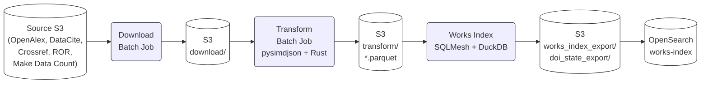
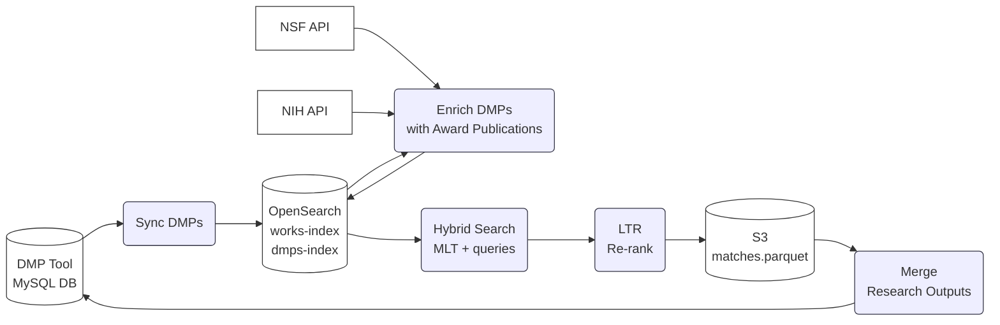
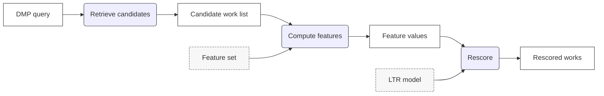
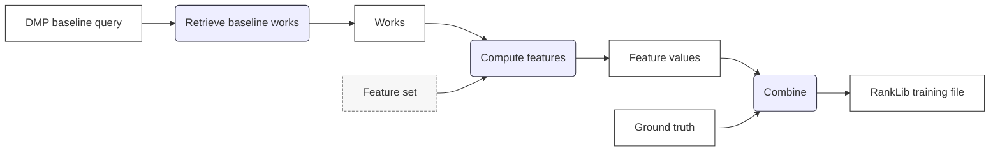

# Architecture

## Overview

The system ingests raw bibliographic datasets, transforms and indexes them into
OpenSearch, then matches published research outputs to Data Management Plans
(DMPs) using a hybrid query strategy and a Learning to Rank model.

The pipeline has two broad phases: **building the works index** (data engineering)
and **running DMP matching** (search and ranking). Both phases can be run
locally via the CLI; in production they are orchestrated as AWS Batch jobs.

### Data Pipeline


```mermaid
flowchart LR
  %% Sources
  S3SRC[("Source S3\n(OpenAlex, DataCite,\nCrossref, ROR,\nMake Data Count)")]

  %% Stages
  DL(Download\nBatch Job)
  TR(Transform\nBatch Job\npysimdjson + Rust)
  SM(Works Index\nSQLMesh + DuckDB)
  OS[("OpenSearch\nworks-index")]

  %% Intermediate
  S3RAW[("S3\ndownload/")]
  S3PAR[("S3\ntransform/\n*.parquet")]
  S3IDX[("S3\nworks_index_export/\ndoi_state_export/")]

  S3SRC --> DL --> S3RAW --> TR --> S3PAR --> SM --> S3IDX --> OS

  %% Styling
  classDef store fill:#fff,stroke:#333;
  classDef process fill:#eef,stroke:#334;
  class S3SRC,S3RAW,S3PAR,S3IDX,OS store;
  class DL,TR,SM process;
```

### DMP Matching Pipeline


```mermaid
flowchart LR
  %% Sources
  DMSP[("DMP Tool\nMySQL DB")]
  NSF[NSF API]
  NIH[NIH API]
  OS[("OpenSearch\nworks-index\ndmps-index")]

  %% Stages
  FETCH(Sync DMPs)
  ENRICH(Enrich DMPs\nwith Award Publications)
  SEARCH(Hybrid Search\nMLT + queries)
  RERANK(LTR\nRe-rank)
  MERGE(Merge\nResearch Outputs)

  %% Intermediates
  PAR[("S3\nmatches.parquet")]

  DMSP --> FETCH --> OS
  NSF & NIH --> ENRICH
  OS --> ENRICH --> OS
  OS --> SEARCH --> RERANK --> PAR --> MERGE --> DMSP

  %% Styling
  classDef store fill:#fff,stroke:#333;
  classDef process fill:#eef,stroke:#334;
  class DMSP,OS,PAR store;
  class FETCH,ENRICH,SEARCH,RERANK,MERGE process;
  class NSF,NIH store;
```

## 1. Dataset Downloads

Raw datasets are downloaded by AWS Batch jobs and staged to a project S3 bucket
before transformation. When running locally, datasets are downloaded manually.

| Dataset                | Source                              |
|------------------------|-------------------------------------|
| OpenAlex Works         | OpenAlex public S3 bucket           |
| DataCite               | DataCite monthly snapshot S3 bucket |
| Crossref Metadata      | Crossref requestor-pays S3 bucket   |
| ROR                    | Zenodo                              |
| Data Citation Corpus   | Zenodo                              |

Each download job:

1. Creates a local staging directory and a target S3 prefix of the form
   `{dataset}/{run_id}/download/`.
2. Cleans any previous content at that prefix.
3. Downloads dataset files locally using [s5cmd](https://github.com/peak/s5cmd),
   a high-performance S3 client that parallelises transfers and supports glob
   patterns, making it significantly faster than the AWS CLI for bulk downloads.
4. Uploads to the project S3 bucket.
5. Cleans up local files (Batch workers are ephemeral).

An optional subsetting step can be applied after download to produce a filtered
dataset scoped to a list of ROR institution IDs or DOIs. This is used in the
dev environment and for testing.

## 2. Dataset Transforms

Downloaded files are transformed by a second set of Batch jobs. Each job
streams gzipped JSON lines files from disk in multiple processes, parses the
fields of interest using [pysimdjson](https://github.com/TkTech/pysimdjson)
(chosen over standard `json` and alternatives for its SIMD-accelerated parsing
and lazy object materialisation — Python object creation is expensive, so
deferring it until fields are accessed gives a significant speedup when only a
subset of each record is needed),
then applies Python and Rust functions to clean and normalise the data before
writing Parquet files to S3 under `{dataset}/{run_id}/transform/`.

### Processing pipeline

The pipeline (`transform/pipeline.py`) runs with a `ProcessPoolExecutor`.
Input files are shuffled before processing because bibliometric datasets such as
OpenAlex order files by `updated_date`, and more recent files contain
significantly more records. Shuffling distributes high-volume and low-volume
files more evenly across worker processes.

Output is written as Parquet with snappy compression. Row groups are targeted
at 128–512 MB to balance memory use during writes against read efficiency in
DuckDB, which benefits from larger row groups for analytical queries.

### Rust functions (`src/`)

The Rust extension module (`dmpworks.rust`, built via PyO3) provides
performance-critical helpers used across all transforms:

| Function                    | Purpose                                                                                                                 |
|-----------------------------|-------------------------------------------------------------------------------------------------------------------------|
| `parse_name()`              | Parse author names into given/surname/initials components using the `human_name` crate                                  |
| `strip_markup()`            | Remove HTML/XML markup from titles and abstracts                                                                        |
| `revert_inverted_index()`   | Decompress OpenAlex inverted-index abstracts, e.g. `{"Hello":[0],"World":[1]}` → `Hello World`                          |
| `has_alphabetic_initials()` | Determine whether first-name initials should be generated for a name — excluded for Korean, Chinese, and Japanese names |

### Per-dataset transforms

#### OpenAlex Works

- DOI extracted by regex, lowercased.
- Strip markup from titles.
- Reconstruct and strip markup from abstracts via `revert_inverted_index()`.
- Parse dates.
- Extract publication venue.
- Emit nested arrays for:
  - **Authors**: names parsed via `parse_name()` into given name, surname, and
    initials; ORCID extracted by regex (four-block `NNNN-NNNN-NNNN-NNNx` pattern),
    lowercased
  - **Institutions**: name; ROR ID extracted by regex (ROR character pattern),
    lowercased
  - **Funders**: funder ID and ROR ID with any embedded URL prefixes removed,
    lowercased; display name
  - **Awards**: award ID and funder ID with any embedded URL prefixes removed,
    lowercased; display name, funder award ID, funder display name

#### DataCite

- DOI extracted by regex, lowercased.
- Strip markup from titles and abstracts.
- Parse dates.
- Fix schema inconsistencies where `affiliation` and `nameIdentifiers` can be
  either a list or a single object.
- Emit nested arrays for:
  - **Authors**: names parsed via `parse_name()` into given name, surname, and
    initials; ORCID extracted by regex from `nameIdentifiers`, lowercased
  - **Institutions**: affiliation identifier with any embedded URL prefixes
    removed, lowercased; affiliation identifier scheme
  - **Funders**: funder identifier with any embedded URL prefixes removed,
    lowercased; funder identifier type, funder name, and award number
  - **Relations**: related identifiers cleaned — DOI extracted by regex where
    possible, otherwise URL prefixes removed; lowercased

#### Crossref Metadata

- DOI extracted by regex, lowercased.
- Strip markup from titles and abstracts.
- Parse dates.
- Emit nested arrays for:
  - **Funders**: funder DOI extracted by regex, lowercased; award number
  - **Relations**: related identifiers cleaned the same way as DataCite

**ROR and Make Data Count** are not transformed at this stage. They are loaded
directly from JSON in SQLMesh (see section 3).

## 3. Works Index

A unified works index is built from the transformed Parquet files using
[SQLMesh](https://sqlmesh.readthedocs.io/en/latest/) and
[DuckDB](https://duckdb.org). SQLMesh manages model dependencies and
incremental execution; DuckDB executes the SQL transformations against
Parquet files on disk.

### Model structure

```text
sql/models/
├── openalex/             — raw Parquet load
├── datacite/             — raw Parquet load
├── crossref/             — raw Parquet load
├── ror/                  — raw ROR dataset loaded from JSON
├── data_citation_corpus/ — raw Data Citation Corpus loaded from JSON
├── openalex_index/       — normalised OpenAlex index + hashes
├── datacite_index/       — normalised DataCite index + hashes
├── crossref_index/       — title and abstract length statistics per DOI
├── relations/            — aggregated work relations (intra-work, shared project, dataset citations)
├── opensearch/           — DOI state tracking (current_doi_state, next_doi_state)
└── works_index/          — final export model
```

### Index content

The works index contains all DataCite works, using DataCite's own metadata
directly. OpenAlex works whose DOIs are not present in DataCite are included and
supplemented with Crossref Metadata (titles, abstracts, funding information).
Institution identifiers (GRID, ISNI) are unified to ROR IDs using ROR data.

Each indexed work contains:

- DOI, title, abstract, publication date, updated date, work type, and venue
- **Authors**: list of structs — ORCID, given name, middle names, surname, initials, full name
- **Institutions**: list of structs — name, ROR ID
- **Funders**: list of structs — name, ROR ID
- **Awards**: list of structs — award ID
- **Relations**: struct containing arrays of intra-work DOIs, shared-project DOIs, and dataset citation DOIs

### Change tracking for incremental updates

Each index model has a corresponding `*_index_hashes` model that computes an
MD5 hash of the normalised work content. Two models manage DOI state:

- **`current_doi_state`** — a persistent table that accumulates the state of
  every DOI across all runs.
- **`next_doi_state`** — compares the hashes of works in the current run
  against the historical state to emit `UPSERT` or `DELETE` records.
  - New DOI → `UPSERT`
  - Changed hash → `UPSERT`
  - DOI previously deleted, now present → `UPSERT`
  - DOI no longer present → `DELETE`

### Export

The `works_index/export` model joins `UPSERT` records from `next_doi_state`
with the full index to produce Parquet export files
(`works_index_export/*.parquet`, target ~500 MB per file) alongside
`doi_state_export/*.parquet`. Both are consumed by the OpenSearch sync step.

## 4. OpenSearch Sync

[OpenSearch](https://opensearch.org) is the search backend for DMP matching.
There are two indexes: `works-index` and `dmps-index`.

### Works index — full load

On the first run, all works from the export Parquet files are synced to
OpenSearch. Each document is indexed by DOI and includes the content hash
for downstream change detection.

### Works index — incremental sync

On subsequent runs, only the `UPSERT` and `DELETE` records from
`doi_state_export` are processed:

- **UPSERT**: only works with a matching DOI in the state file are sent to
  OpenSearch.
- **DELETE**: documents are removed from the index by DOI.

This ensures that unchanged works are never re-indexed, keeping sync times
proportional to the volume of change rather than the total corpus size.

### DMPs index

DMPs are fetched from the DMP Tool MySQL database and synced to `dmps-index`.
Each DMP document includes project metadata (title, abstract, dates),
institutions, authors, funders, and external data (award IDs and funded DOIs
fetched from NSF and NIH). The enriched DMP documents enable query-by-example
and structured filter queries at search time.

### Index mapping

Both indexes use nested field mappings for `authors`, `institutions`,
`funders`, and `relations`. Nested objects allow match details (which author,
which award, which institution) to be surfaced in the DMP Tool UI alongside
each candidate work.

## 5. DMP Matching Pipeline

### Step 1 — Sync DMPs

DMPs are fetched from the DMP Tool MySQL database and synced to `dmps-index`
in OpenSearch, creating documents with project metadata, authors, institutions,
and funding records.

### Step 2 — Enrich DMPs

As a separate step, each DMP document in OpenSearch is enriched with award
publication data. For each DMP's funding records, award IDs are queried against
funder APIs to retrieve associated publication DOIs:

- **NSF**: award IDs are queried against the NSF Award Search API.
- **NIH**: award IDs are queried to retrieve associated publications; the
  PubMed API is used to convert PubMed IDs and PMC IDs to DOIs.

The results are written back to the DMP document in OpenSearch as `external_data`
(a list of awards, each with its associated funded DOIs). Enrichment is
idempotent: only DMPs modified since the last enrichment are updated.

Award IDs are expanded into multiple variants before querying funder APIs.
For NSF awards this includes the bare numeric ID (e.g. `1507101`),
`ORG 1507101`, and `ORG-1507101`. For NIH awards this includes combinations of
activity code, application type, institute code, serial number, support year,
and suffix (e.g. `AI176039`, `R01AI176039`, `1R01AI176039-01`), with and
without spacing and hyphens.

### Step 3 — Hybrid OpenSearch search

For each DMP, a structured query is built by `opensearch/query_builder.py` and
executed against `works-index`. The query combines:

| Component    | Mechanism                                                            |
|--------------|----------------------------------------------------------------------|
| Funded DOIs  | `constant_score` filter on DOIs retrieved during the enrichment step |
| Award IDs    | Match on work award numbers                                          |
| Authors      | ORCID (exact nested) and full name (exact phrase)                    |
| Institutions | ROR ID (exact nested) and institution name (fuzzy, phrase slop=3)    |
| Funders      | Funder ID (exact nested) and funder name (fuzzy, phrase slop=3)      |
| Content      | More Like This (MLT) on title and abstract                           |

Results are filtered to works whose publication date falls within the DMP
project dates (with a configurable buffer). Searches for multiple DMPs can be
executed in parallel using OpenSearch's `msearch` API.

### Step 4 — LTR re-ranking

Candidate works from the baseline query are optionally re-ranked using the
[OpenSearch Learning to Rank](https://docs.aws.amazon.com/opensearch-service/latest/developerguide/learning-to-rank.html)
plugin. See section 6 for details.

### Step 5 — Write results back to DMP Tool

Ranked candidates are written as Parquet to S3, then merged into the DMP Tool
MySQL database (`related_works` table) by a final Batch job. Each row records
the DMP DOI, the matched work DOI, the match score, and structured match
details (which signals contributed to the match) for display in the DMP Tool UI.

## 6. Learning to Rank

OpenSearch Learning to Rank (LTR) re-ranks candidate works using a machine
learning model trained on a ground truth dataset of DMP-to-published-work
matches.

### Search Process

A DMP query is first used to retrieve an initial list of candidate works using
a baseline search. For each candidate, a predefined feature set is applied to
compute feature values that describe the relationship between the DMP and the
candidate works. These feature values, together with the trained LTR model,
are then used to rescore the candidates. The output is the same set of candidate
works, reordered according to their predicted relevance.


```mermaid
flowchart LR
  %% Artifacts (data)
  DMPQ[DMP query]
  CAND[Candidate work list]
  FVALS[Feature values]
  OUT[Rescored works]

  %% Configuration / models
  FSET[Feature set]
  MODEL[LTR model]

  %% Processes
  P1(Retrieve candidates)
  P2(Compute features)
  P3(Rescore)

  DMPQ --> P1 --> CAND
  CAND --> P2
  FSET --> P2
  P2 --> FVALS
  FVALS --> P3
  MODEL --> P3
  P3 --> OUT

  %% Styling
  classDef artifact fill:#fff,stroke:#333;
  classDef process fill:#eef,stroke:#334;
  classDef config fill:#f7f7f7,stroke:#666,stroke-dasharray: 4 2;

  class DMPQ,CAND,FVALS,OUT artifact;
  class P1,P2,P3 process;
  class FSET,MODEL config;
```

### Training Process

A baseline query is run for each DMP to retrieve a set of candidate works.
The same feature set used at search time is applied to compute feature values
for these candidates. The computed feature values are then combined with ground
truth relevance judgments to produce a RankLib-formatted training file.
This training file is used to train the LTR model that is later applied during
search reranking.


```mermaid
flowchart LR
  %% Artifacts (data)
  DMPB[DMP baseline query]
  WORKS[Works]
  FVALS[Feature values]
  GT[Ground truth]
  RL[RankLib training file]

  %% Configuration
  FSET[Feature set]

  %% Processes
  P1(Retrieve baseline works)
  P2(Compute features)
  P3(Combine)

  DMPB --> P1 --> WORKS
  WORKS --> P2
  FSET --> P2
  P2 --> FVALS
  FVALS --> P3
  GT --> P3
  P3 --> RL

  %% Styling
  classDef artifact fill:#fff,stroke:#333;
  classDef process fill:#eef,stroke:#334;
  classDef config fill:#f7f7f7,stroke:#666,stroke-dasharray: 4 2;

  class DMPB,WORKS,FVALS,GT,RL artifact;
  class P1,P2,P3 process;
  class FSET config;
```

### Feature Set

The following is a summary of the LTR feature set used for training:

1. **mlt_content**: the [More Like This](https://docs.opensearch.org/latest/query-dsl/specialized/more-like-this/) score calculated between the titles and abstracts of the DMP and the work.
1. **funded_doi_matched**: whether a known funded DOI matched.
1. **dmp_award_count**: the number of awards that the DMP has.
1. **award_match_count**: the number of DMP awards that matched with the work.
1. **dmp_author_count**: the number of DMP authors.
1. **author_orcid_match_count**: the number of DMP ORCID IDs that matched with the work.
1. **author_surname_match_count**: the number of DMP author surnames that matched with the work.
1. **dmp_institution_count**: the number of DMP institutions.
1. **institution_ror_match_count**: the number of DMP ROR IDs that matched with the work.
1. **institution_name_match_count**: the number of DMP institution names that matched with the work.
1. **dmp_funder_count**: the number of DMP funders.
1. **funder_ror_match_count**: the number of DMP funder ROR IDs that matched with the work.
1. **funder_name_match_count**: the number of DMP funder names that matched with the work.
1. **intra_work_doi_count**: the number of published research output DOIs from the DMP that matched the work's intra-work DOIs (i.e., DOIs representing the same work).
1. **possible_shared_project_doi_count**: the number of published research output DOIs from the DMP that matched the work's possible shared-project DOIs (i.e., DOIs linked through relationships that could originate from the same project).
1. **dataset_citation_doi_count**: the number of published research output DOIs from the DMP that matched the work's dataset citation DOIs (i.e., DOIs linked through dataset citation relationships).

The feature set is defined in the `build_featureset` function in:<br>
[learning_to_rank.py](../python/dmpworks/opensearch/learning_to_rank.py).
