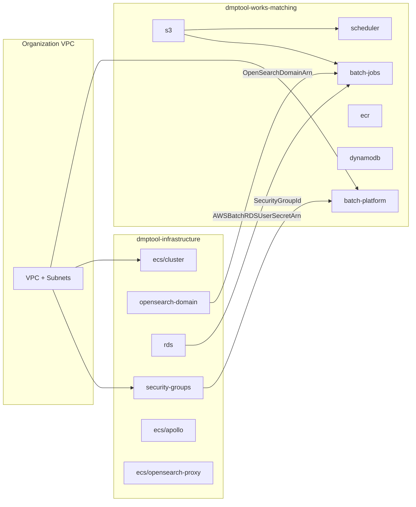
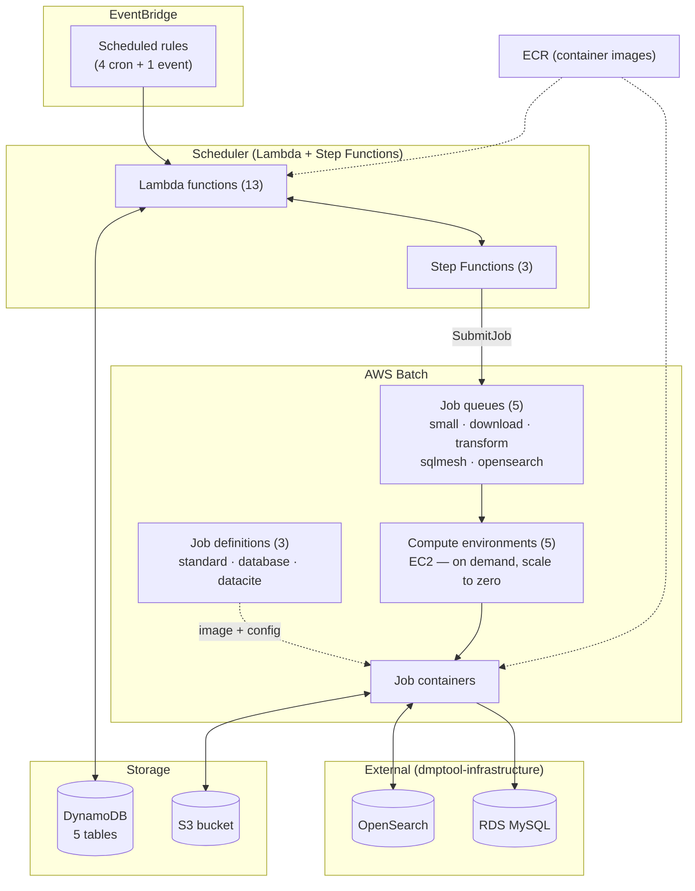
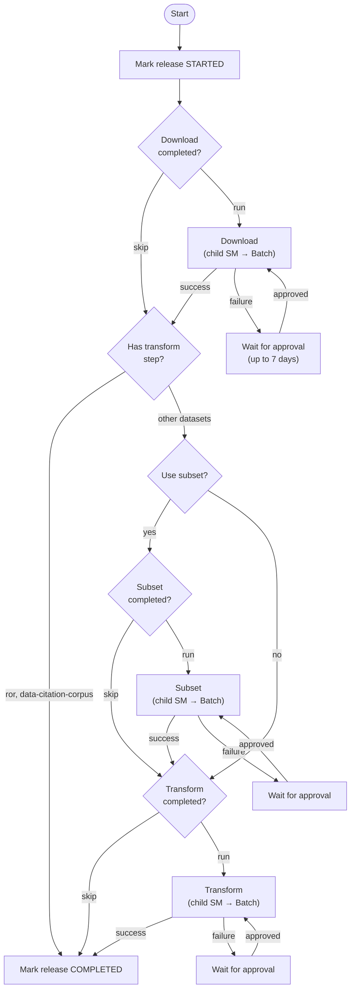
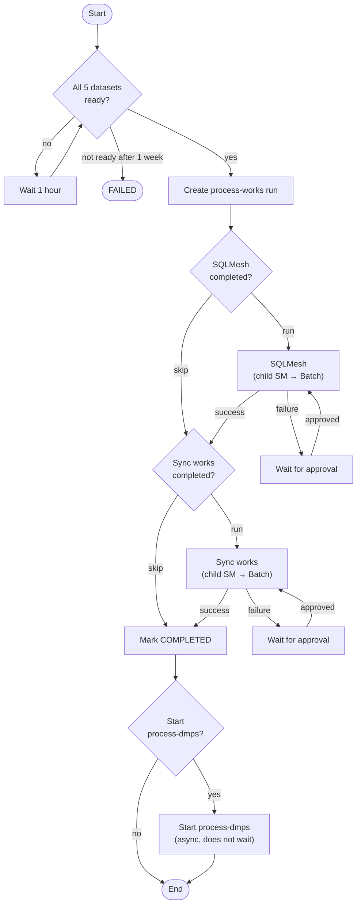
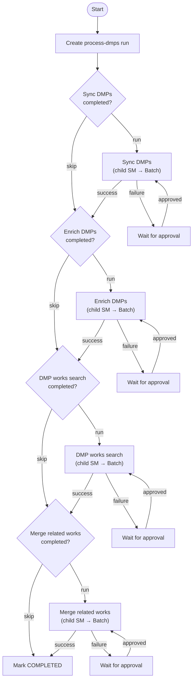

# AWS Architecture

- [Cross-project stack dependencies](#cross-project-stack-dependencies)
- [Runtime resource flow](#runtime-resource-flow)
- [External dependencies](#external-dependencies)
- [EventBridge Schedules](#eventbridge-schedules)
- [State Machines](#state-machines)
  - [Dataset Ingest](#dataset-ingest)
  - [Process Works](#process-works)
  - [Process DMPs](#process-dmps)

Infrastructure is deployed via [Sceptre](https://docs.sceptre-project.org/)
from `infra/`. This project's stacks depend on shared infrastructure managed in
a separate Sceptre project (`dmptool-infrastructure`) via `!stack_output_external`
references. The dependency is one-way — dmptool-infrastructure has no references
back to this project.

## Cross-project stack dependencies

## Runtime resource flow

## External dependencies

Resources imported from other CloudFormation stacks at deploy time via
`!stack_output_external` (configured in `infra/vars-{env}.yaml`):

| What                  | Source stack                             | Consumer       |
|-----------------------|------------------------------------------|----------------|
| VPC ID                | Organization VPC stack                   | batch-platform |
| Subnet ID             | Organization subnet stack                | batch-platform |
| Security Group ID     | dmptool-infrastructure security-groups   | batch-platform |
| OpenSearch Domain ARN | dmptool-infrastructure opensearch-domain | batch-jobs     |
| RDS User Secret ARN   | dmptool-infrastructure rds               | batch-jobs     |

## EventBridge Schedules

Four scheduled rules trigger the pipeline. Schedules can be managed with
[`dmpworks pipeline schedules`](pipeline.md#schedules).

| Schedule                   | Cron                       | Timing (PDT)                    | Triggers                                                               |
|----------------------------|----------------------------|---------------------------------|------------------------------------------------------------------------|
| `version-checker-schedule` | `cron(0 15 ? * MON-FRI *)` | Mon-Fri 08:00                   | Checks for new dataset releases; starts dataset-ingest per new release |
| `process-works-schedule`   | `cron(0 16 ? * 2#2 *)`     | 2nd Monday 09:00                | Starts the process-works pipeline                                      |
| `process-dmps-schedule`    | `cron(0 3 ? * TUE-SAT *)`  | Mon-Fri 20:00                   | Starts the process-dmps pipeline                                       |
| `s3-cleanup-schedule`      | `cron(0 0 L * ? *)`        | Last day of month 17:00         | Schedules stale S3 run data for lifecycle expiry                       |

An additional **ExecutionFailedRule** watches all state machines for FAILED or
ABORTED executions and routes them to a failure handler Lambda that updates the
corresponding DynamoDB run records.

## State Machines

The scheduler stack defines 3 parent state machines and 9 child state machines.
Each child follows the same pattern: build Batch job parameters, submit the job,
mark the task complete, and signal the parent. On failure, the parent enters an
approval gate that waits up to 7 days for manual retry via
[`dmpworks pipeline runs approve-retry`](pipeline.md#23-approve-retry).

All state machines use checkpoint-based skip logic — before invoking a child,
the parent checks DynamoDB for an existing task checkpoint. If one exists, the
step is skipped, so re-runs after partial failures only repeat the failed steps.

### Dataset Ingest

Started per-dataset by the version checker when a new release is discovered.

Datasets: openalex-works, datacite, crossref-metadata, ror, data-citation-corpus.
ROR and Data Citation Corpus only need the download step.

### Process Works

Runs monthly. Waits for all 5 dataset ingests to complete, then builds the
unified works index and syncs it to OpenSearch.

Required dataset checkpoints: openalex-works (transform), datacite (transform),
crossref-metadata (transform), ror (download), data-citation-corpus (download).

### Process DMPs

Runs daily on weekdays. Also started by process-works on completion
(async — process-works does not wait for it to finish).

Steps: sync-dmps, enrich-dmps, dmp-works-search, merge-related-works.
