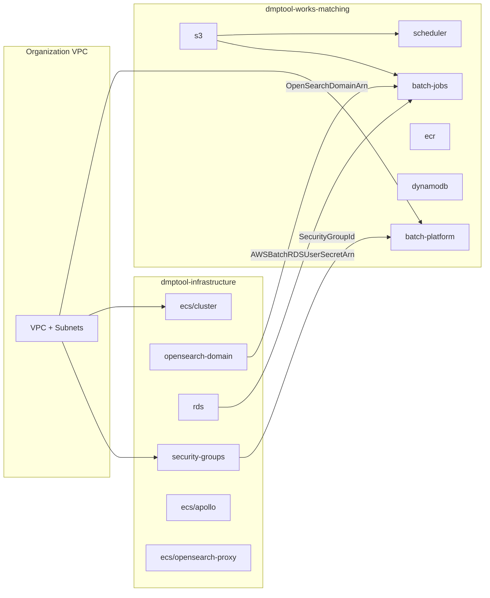
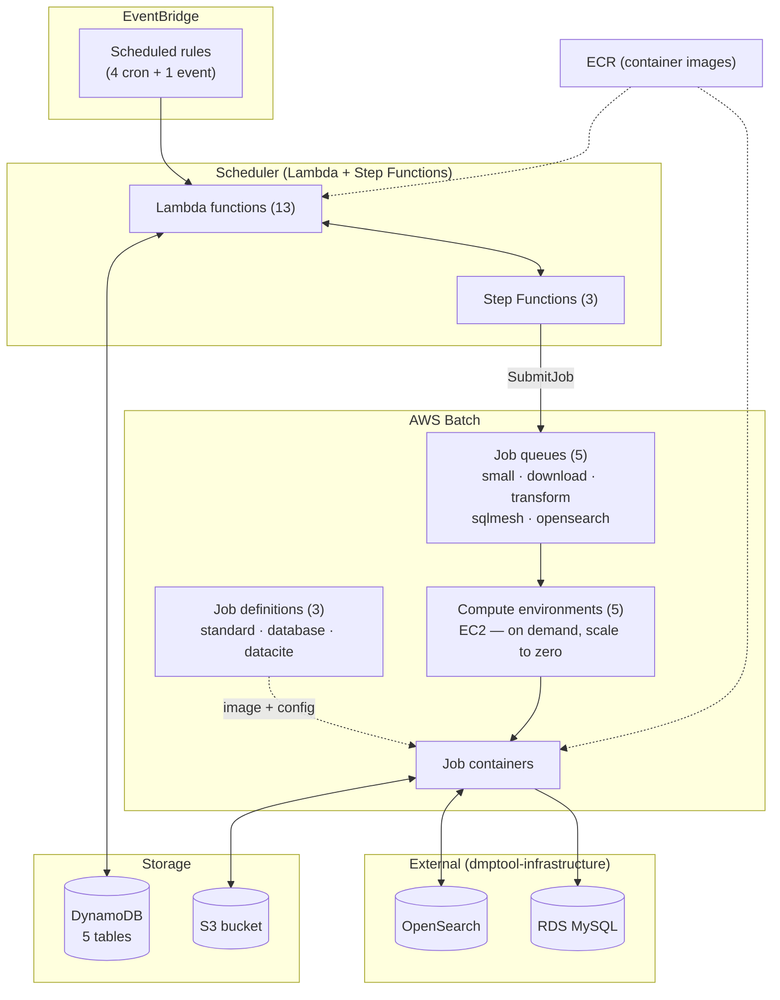

# CloudFormation Infrastructure

Infrastructure is deployed via [Sceptre](https://docs.sceptre-project.org/)
from `infra/`. This project's stacks depend on shared infrastructure managed in
a separate Sceptre project (`dmptool-infrastructure`) via `!stack_output_external`
references. The dependency is one-way — dmptool-infrastructure has no references
back to this project.

## Cross-project stack dependencies

## Runtime resource flow

## External dependencies

Resources imported from other CloudFormation stacks at deploy time via
`!stack_output_external` (configured in `infra/vars-{env}.yaml`):

| What                  | Source stack                                 | Consumer        |
|-----------------------|----------------------------------------------|-----------------|
| VPC ID                | Organization VPC stack                       | batch-platform  |
| Subnet ID             | Organization subnet stack                    | batch-platform  |
| Security Group ID     | dmptool-infrastructure security-groups       | batch-platform  |
| OpenSearch Domain ARN | dmptool-infrastructure opensearch-domain     | batch-jobs      |
| RDS User Secret ARN   | dmptool-infrastructure rds                   | batch-jobs      |
