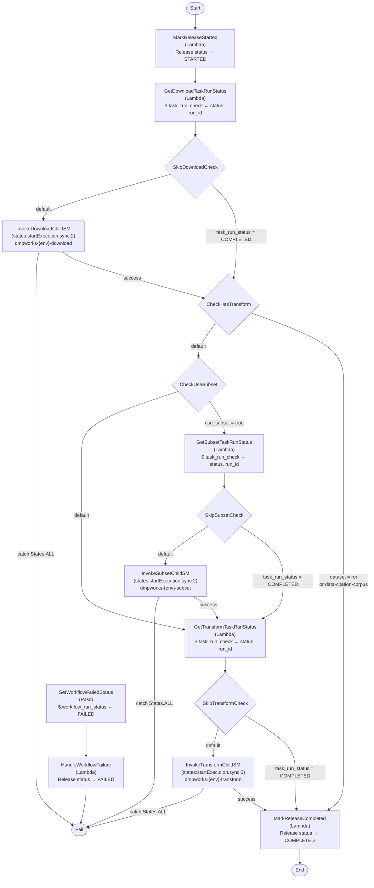
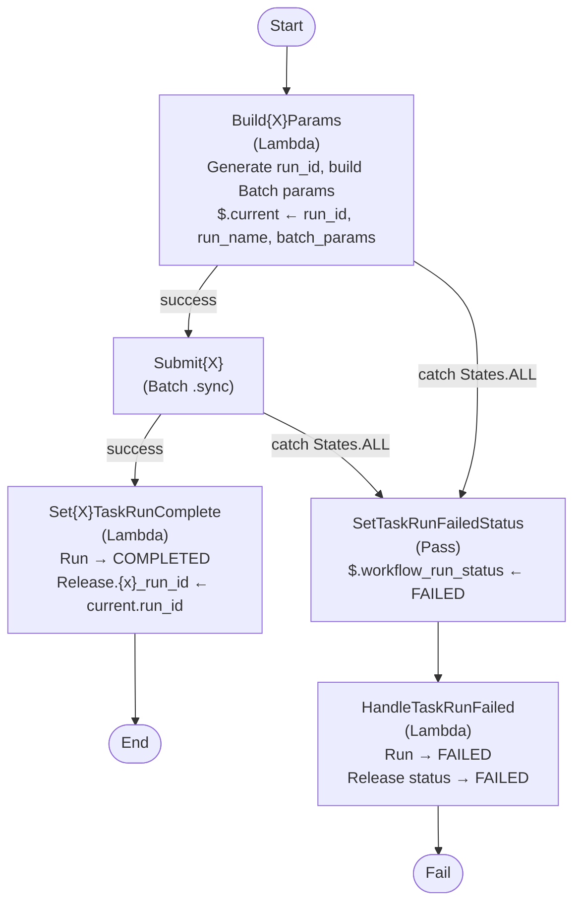

# Dataset Ingest Workflow

Parent state machine that orchestrates three child state machines (download, subset, transform).
Each child SM is an independent redrivable unit. Skip logic detects already-completed task runs
via DynamoDB and bypasses the corresponding child SM invocation.

## Child state machine pattern

Each child SM (download / subset / transform) follows the same pattern:

## Error handling

- **Child SM failures**: The child SM's own handler marks both the `TaskRunRecord` and the release status as FAILED before reaching its `TaskRunFailed` state. The parent catches the child SM failure and jumps directly to `WorkflowFailed` — no additional Lambda call needed.
- **Parent-level failures** (MarkReleaseStarted, GetTaskRunStatus): Route through `SetWorkflowFailedStatus` → `HandleWorkflowFailure` → `WorkflowFailed`.

## Skip logic

On fresh re-runs, `GetXxxTaskRunStatus` checks whether `{task_type}_run_id` is set on `DatasetReleaseRecord`. That field is only written after a task run completes successfully, so its presence guarantees the task run is safe to skip. If `task_run_status == "COMPLETED"`, the corresponding child SM invocation is bypassed entirely.
